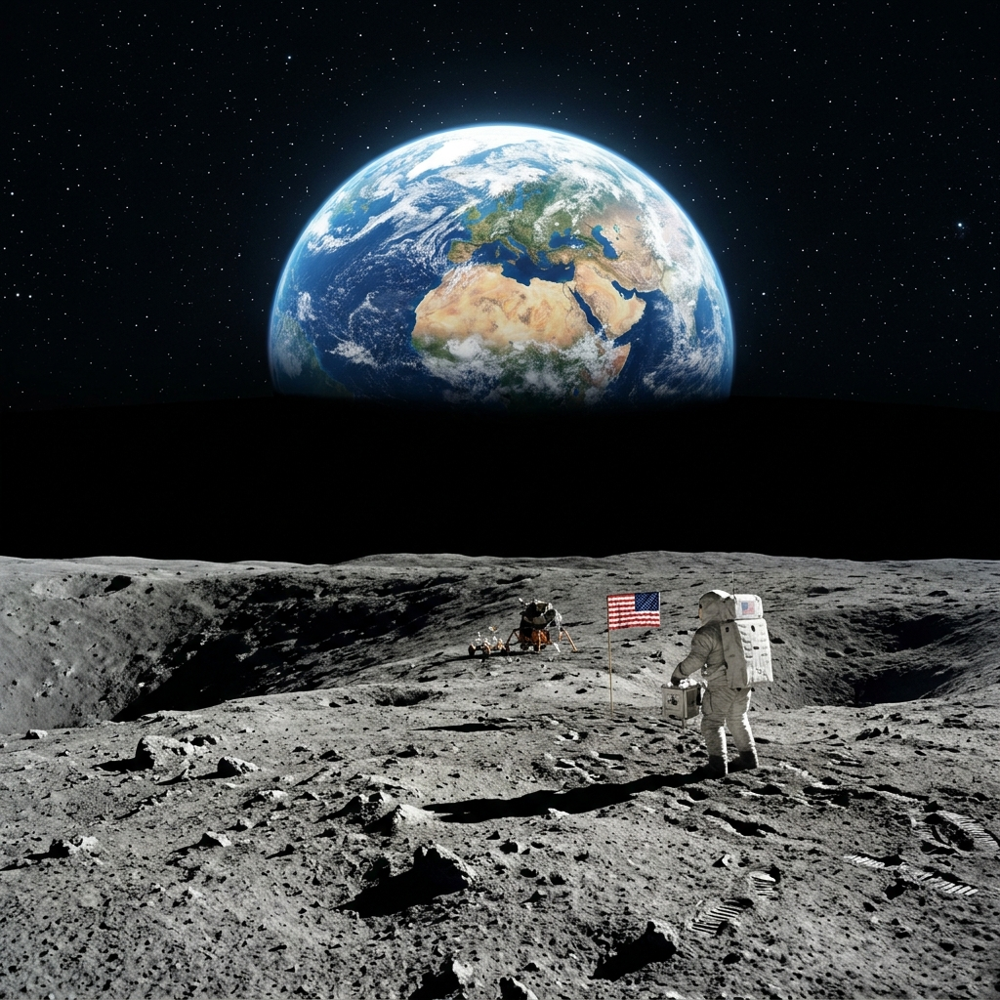

# Chandra Drishti 🌕

<p align="center">
  
</p>

**Chandra Drishti** (Lunar Vision) is an AI-powered analytical tool designed to identify safe lunar landing zones and plan rover exploration paths. It processes standard optical images, Digital Elevation Models (DEM), and orthomosaics to assess terrain safety using computer vision and machine learning.

## ✨ Features

- **Crater Detection**: Utilizes a custom PyTorch Faster R-CNN model (`fasterrcnn_mobilenet_v3_large_fpn`) to accurately detect craters from optical images.
- **Slope & Hazard Analysis**: Calculates slope gradients from DEMs to identify dangerously steep terrain.
- **Shadow Detection**: Identifies permanent or hazardous shadowed regions that could obstruct solar panels or visibility.
- **Safe Landing Zone Identification**: Computes a master safety map by combining all hazard masks to find the optimal primary landing zone, complete with confidence percentages.
- **Contingency Planning**: Identifies alternative "sub-optimal" backup landing zones if the primary zone is compromised.
- **Rover Pathfinding**: Plots the shortest, safest path from the landing zone to the nearest crater (potential water-ice source) avoiding known hazards.
- **Super Resolution (SR)**: Optional algorithmic image upscaling (Lanczos4 + Unsharp Masking) to enhance resolution for finer grid analysis.

## 🛠 Tech Stack

- **Frontend**: Vanilla HTML5, CSS3, JavaScript
- **Backend**: Python, Flask, Gunicorn
- **Machine Learning**: PyTorch, TorchVision
- **Computer Vision**: OpenCV (opencv-python-headless), NumPy, Pillow

## 📂 Project Structure

```
.
├── backend/
│   ├── server.py             # Flask API server & ML inference logic
│   └── requirements.txt      # Python dependencies (optimized for CPU deployment)
├── frontend/
│   ├── index.html            # Main UI
│   ├── style.css             # Styling and layout
│   └── script.js             # Client-side logic and API communication
├── render.yaml               # Render Blueprint for automated backend deployment
└── trained_model.pth         # PyTorch weights for the crater detection model
```

## 🚀 Local Setup

### Prerequisites
- Python 3.9+
- A modern web browser

### 1. Start the Backend
Navigate to the root directory of the project and install the dependencies:
```bash
cd backend
pip install -r requirements.txt
```

Run the Flask server (from the root directory so it finds the model):
```bash
cd ..
python backend/server.py
```
*The API will start on `http://127.0.0.1:5000`.*

### 2. Start the Frontend
Simply open `frontend/index.html` in your web browser. Or, you can serve it via a local static server:
```bash
cd frontend
python -m http.server 8000
```
Then visit `http://localhost:8000`.

## ☁️ Deployment

This project is configured to be easily deployed to **Vercel** and **Render**.

### Backend (Render)
[](https://render.com/deploy?repo=https://github.com/asthagupta0211/CHANDRA-DRISHTI)

1. Click the **Deploy to Render** button above.
2. Render will automatically detect the `render.yaml` file and deploy the Flask API.

### Frontend (Vercel)
1. Connect this repository to [Vercel](https://vercel.com/).
2. Set the "Root Directory" to `frontend`, and deploy.
   - *Note: Once the backend is live, remember to update the `PROD_BACKEND_URL` in `frontend/script.js` with your new Render URL and push to GitHub.*

